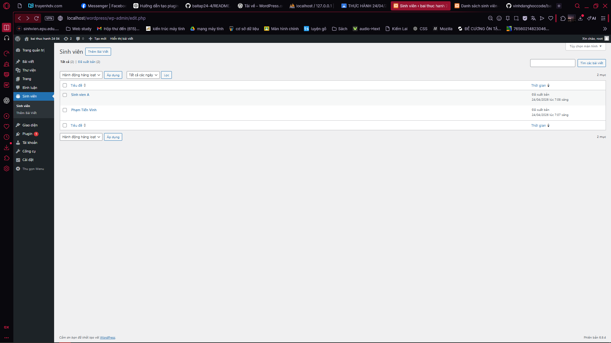
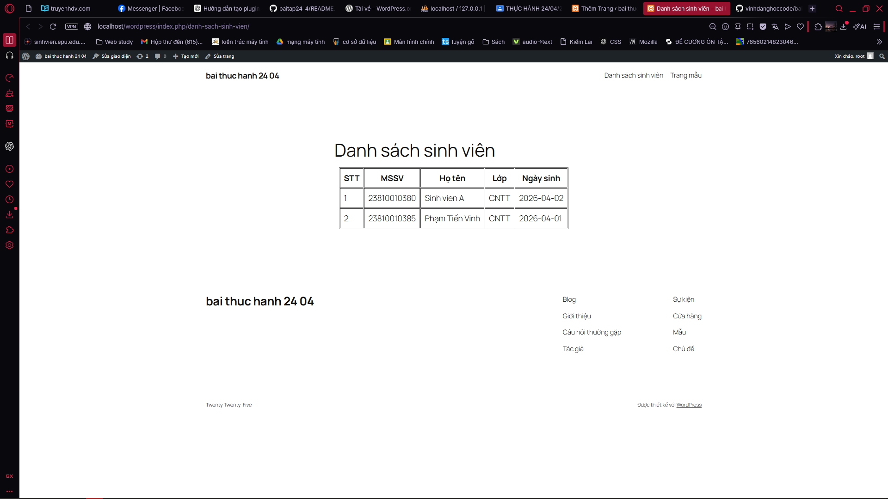

## 🧱 Cấu trúc thư mục

```
student-manager/
│── student-manager.php        # File chính của plugin
│
├── includes/                  # Chứa các file xử lý logic
│   ├── cpt.php               # Đăng ký Custom Post Type (Sinh viên)
│   ├── meta-box.php          # Tạo và lưu Meta Box (MSSV, Lớp, Ngày sinh)
│   ├── shortcode.php         # Tạo shortcode hiển thị danh sách sinh viên
│
└── assets/                   # Tài nguyên giao diện (CSS)
    └── style.css            # CSS cho bảng hiển thị
```
Kết quả đạt được:

